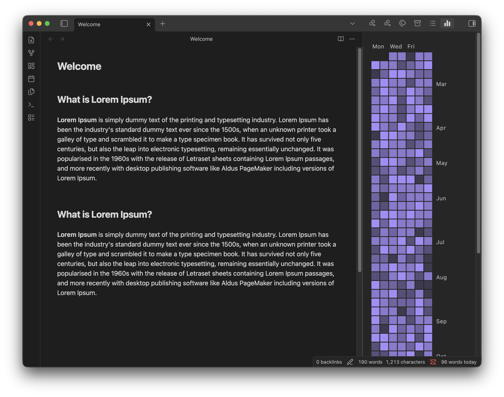

## Obsidian Daily Heatmap

This is a daily word count and heatmap plugin that is forked from https://github.com/dhruvik7/obsidian-daily-stats. I wanted to update it to modernize the libraries and fix some bugs I was experiencing. 

### Features

You can see today's word count in the bottom right corner of your screen, and a  heatmap in the right panel view akin to Github's contribution graph.

